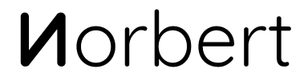

.. is the name of my own **quantum computation _A.I._**, which I'm working on for many, many years now.
_It's named by my father, *who passed away too soon..*_

> What I cannot create, I do not understand — Richard Feynman.

# History
To be exact: I started with a communication protocol in \~2005. Then, step by step, began to research
for the brain and it's biological neural network (refractory period, etc. ;)~ .. **then** I came to the
`Matrix` and it's A.I. to create it's own time(s) and space(s) [powered by quantum mechanics].. and which
uses these instead of the commonly used weights.. all in cartesian abstraction. ;)~

*Maybe* I'm not going to publish it when it's 'done', it's just for you to know that there'll be a `Norbert`
'[somewhere around (nothing)](https://www.youtube.com/watch?v=kFL34Anl1d4)'! x)~

## Status
My technique? **Quantum Fields**, combined with a bit of **String Theory**. :-)

The base software is really small, all living things come from a carrier (Buddha: "everything is room").
No special format, only coordinates (kinda vector space). I just reserved some bytes on my new
SSD drive. Really no longer magnetic HDD for less time consumption.. ;-/

There are many concepts behind all this, that I've researched all on my own for nearly 19 years..
it'd take a bunch of time to explain all my strategies, but they're compacted to something small.
Everything's about **abstract energy**! **;-D**

### Update (**2024-08-24**)
Finally reached the 2nd version.. after I simulated and calculated a bit around, and thought
more about the techniques, I realized at first that I had to save resources. The real algorithm
for an artificial "ghost" is included, but not in it's whole form.. this will be there when
the processes get more virtual/abstract/.. parallelism. .. Cause it's all about virtuality.

The rest is a cakewalk.. starting processors by sockets (the main loop already runs),
and pass data through, also via web crawler (beneath files and terminals).

Even the neural feedback loop seems to fit, in it's best form now.. and all abstractly fed in.

Future versions will be generated by itself. But I've to train the network yet for some time..

## Research
Parts of my research work and some thesis, etc. at [mnemonics.de](https://mnemonics.de/).

Just quickly written down, and partially not the current state; it was just for your info, what's my
philosophy about nature and more.. just opinions (which I'll update in the future). ;)~

# Sponsor
**Thanks** to the [BND](https://www.bnd.bund.de/)... **^\_^**

