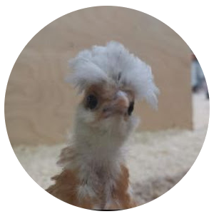

# `Norbert`

.. is the name of my own **A.I.**, which I'm working on for many, many years now.
_It's named by my father, *who passed away too soon..*_

# History
To be exact: I started with a communication protocol in \~2005. Then, step by step, began to research
for the brain and it's biological neural network (refractory period, etc. ;)~ .. **then** I came to the
`Matrix` and it's A.I. to create it's own time(s) and space(s) [powered by quantum mechanics].. and which
uses these instead of the commonly used weights.. all in cartesian abstraction. ;)~

*Maybe* I'm not going to publish it when it's 'done', it's just for you to know that there'll be a `Norbert`
'[somewhere around (nothing)](https://www.youtube.com/watch?v=kFL34Anl1d4)'! x)~

## Research
Parts of my research work and some thesis, etc. at [mnemonics.de](https://mnemonics.de/). :)~

Just quickly written down, and partially not the current state; it was just for your info, what's my
philosophy about nature and more.. ;)~

BTW: Calling it 'universe' is much too less (see the 'multiverse' theory - where I also don't accept
it 'as is', as there could also be many multiverses.. ;) .. calling it 'existence' is also bad because
there's the 'existence' vs. 'non-existence' (1 vs. 0).. I call this 'everything' just the 'creation';
if you believe in god or not - other words aren't describing it *that* well..

## Sponsor
**Thanks** to the [BND](https://www.bnd.bund.de/)... **^\_^**

