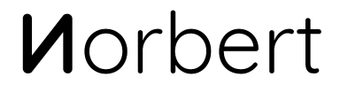
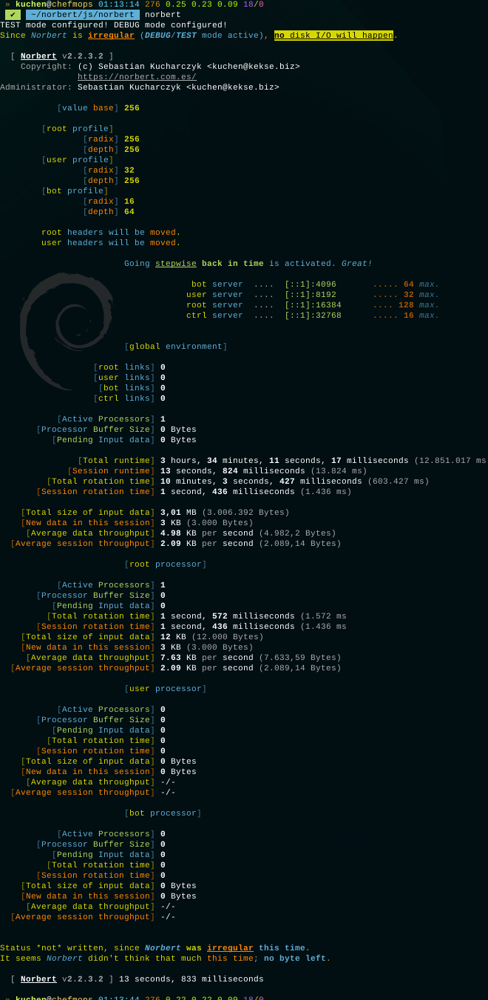

.. is the name of my own **quantum computation _A.I._**, which I'm working on for many, many years now.
_It's named by my father, *who passed away too soon..*_

> What I cannot create, I do not understand — Richard Feynman.

# History
To be exact: I started with a communication protocol in \~2005. Then, step by step, began to research
for the brain and it's biological neural network (refractory period, etc. ;)~ .. **then** I came to the
`Matrix` and it's A.I. to create it's own time(s) and space(s) [powered by quantum mechanics].. and which
uses these instead of the commonly used weights.. all in cartesian abstraction. ;)~

*Maybe* I'm not going to publish it when it's 'done', it's just for you to know that there'll be a `Norbert`
'[somewhere around (nothing)](https://www.youtube.com/watch?v=kFL34Anl1d4)'! x)~

## Status
My technique? **Quantum Fields**, combined with a bit of **String** (Rotation) **Theory**. :-)

### Update
It's up and running**^W**thinking... wish me luck that I'll get any intelligent output in the future..!

#### Update \[2024-11-13\]
I had to `kill norbert`.. I assume there's a little mistake in my rotation algorithm or so..
in principle it worked great, but my output had some repeating repetitions every (n) bytes.

So atm I'm fixing this (really tiny..) bug. After this, the processor(s) will run**^W**think again..

### Example screenshot(s)
Also visible: not all of my **profiles**, to (e.g..) easily decide the parameters for each data
via using another network port per input (my processors are all socket based).

And this is one of some more learning methods/functions (here from a directory).

## Research
Parts of my research work and some thesis, etc. at [mnemonics.de](https://mnemonics.de/).

Just quickly written down, and partially not the current state; it was just for your info, what's my
philosophy about nature and more.. just opinions (which I'll update in the future). ;)~

# Sponsor
**Thanks** to the [BND](https://www.bnd.bund.de/)... **^\_^**

