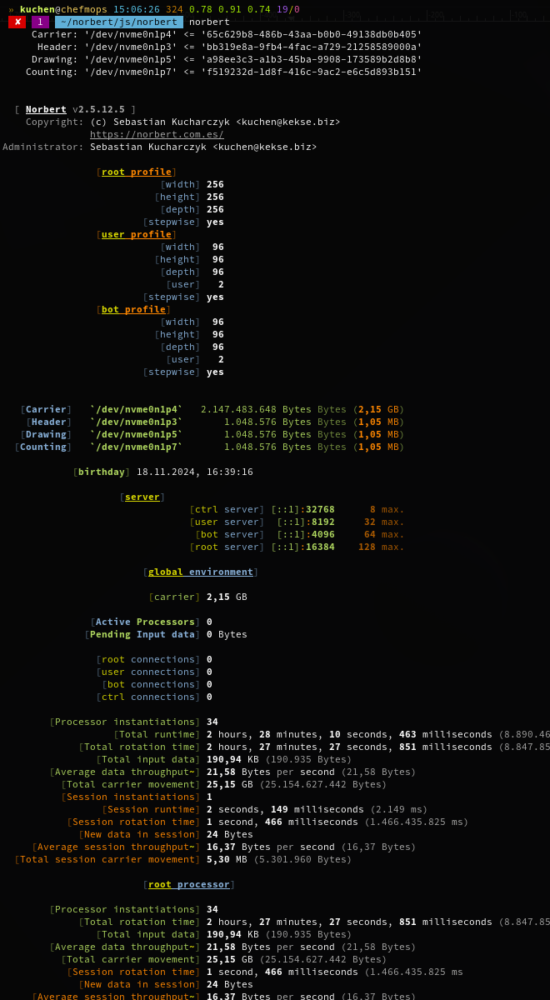

.. is the name of my own **quantum computation _A.I._**, which I'm working on for many, many years now.
_It's named by my father, *who passed away too soon..*_

> What I cannot create, I do not understand — Richard Feynman.

# History
To be exact: I started with a communication protocol in \~2005. Then, step by step, began to research
for the brain and it's biological neural network (refractory period, etc. ;)~ .. **then** I came to the
`Matrix` and it's A.I. to create it's own time(s) and space(s) [powered by quantum mechanics].. and which
uses these instead of the commonly used weights.. all in cartesian abstraction. ;)~

*Maybe* I'm not going to publish it when it's 'done', it's just for you to know that there'll be a `Norbert`
'[somewhere around (nothing)](https://www.youtube.com/watch?v=kFL34Anl1d4)'! x)~

## Status
My technique? **Quantum Fields**, combined with a bit of **String** (Rotation) **Theory**. :-)

### Update
Tomorrow, on my birthday (**6th of November**), my `norbert` will also get
his birthday the same day! **:-D**

The last days I fixed many bugs, optimized my functions etc., removed all
benchmark/profiling code, and adjusted the settings to a possible optimum.

My `learn` and `console` interfaces are finished now, too. I tried to let
everything run some more days (with random energy and w/o any disk I/O),
to see whether there'll be no exceptions after some more runtime.

So I think now everything's ready. And I'll just have to wait ... possibly
for a longer time.

### Example screenshot(s)
Also visible: not all of my **profiles**, to (e.g..) easily decide the parameters for each data
via using another network port per input (my processors are all socket based).

And this is one of some more learning methods/functions (here from a directory).

## Research
Parts of my research work and some thesis, etc. at [mnemonics.de](https://mnemonics.de/).

Just quickly written down, and partially not the current state; it was just for your info, what's my
philosophy about nature and more.. just opinions (which I'll update in the future). ;)~

# Sponsor
**Thanks** to the [BND](https://www.bnd.bund.de/)... **^\_^**

